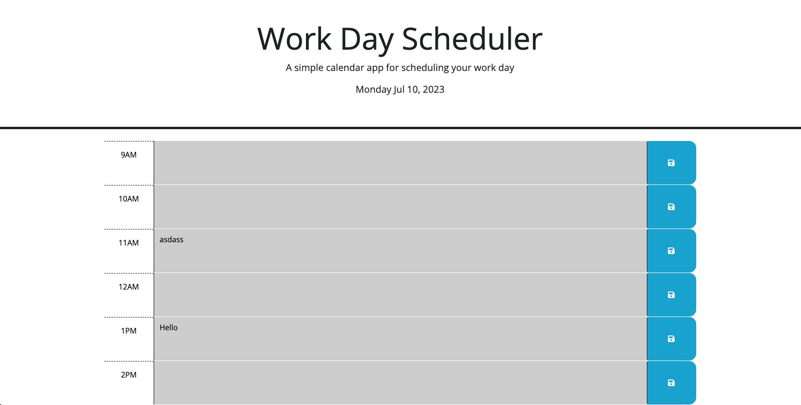

# Work-Day-Scheduler

## User Story

As an employee with a busy schedule, I want too to add important events to a daily planner so I can manage my time effectively

## Acceptance Criteria

GIVEN I am using a daily planner to create a schedule

-When I open the planner, Then the current day is displayed at the top of the calendar.
-When I scroll down, Then I am presented with time blocks for standard business hours of 9am to 5pm.
-When I view the time blocks for that day, Then each time block is color-coded to indicate whether it is in the past, present, or future.
-When I click into a time block, Then I can enter an event.
-When I click the save button for that time block, Then the text for that event is saved in local storage.
-When I refresh the page, Then the saved events persist.

## Mock-Up

The following animation demonstrates the application functionality:

## Live Demo

A Live Demo Can be Found [Here](https://julianmlacey.github.io/Work-Day-Scheduler/)

## License

View "LICENSE" in Repository
